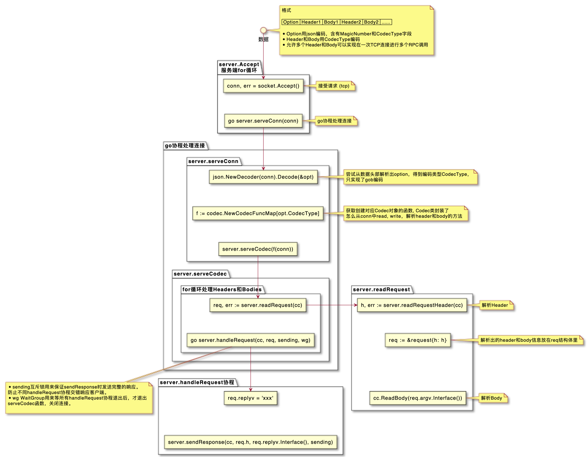
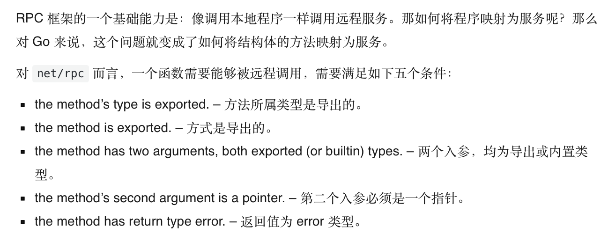

# 详细实现

## 1-codec

- 实现**编/解码**(消息的序列化/反序列化)
- 实现一个**简易服务端**(server)来接受消息
- 在`main()`中使用`net.Dial()`拨号模拟一次rpc请求(客户端)
- 编码时使用`bufio.Writer`创建**写缓冲**，提高发送请求性能
- 在解码时使用`sync.Mutex`互斥锁来确保其他go协程往同一个缓冲区写入
- 处理请求时使用`sync.WaitGroup`同步器来确保**一次连接**中，服务端能处理完**所有请求**后，再断开连接

这里引用下网友`panjianning`的UML图:


## 2-client

- 实现一个支持异步和高并发的客户端

客户端和服务端一次连接 的报文格式如下:

>>| Option{MagicNumber: xxx, CodecType: xxx} | Header{ServiceMethod ...} | Body interface{} |
>
>> <------      固定 JSON 编码      ------>  | <-------   编码方式由 CodeType 决定   ------->|
>
>>|协议交换|请求头|请求体|请求头|请求体|
- 使用`sync.Mutex`互斥锁,来确保客户端**多个请求发送**时的可用性
- 基于`net.Dia()`实现客户端的`Dial()`功能，连接过程为

    - 解析opt格式
  
        - 没有入参opt则按照默认RPC编码格式
    - 使用`net.Dia()`连接服务端，使用返回的`conn`对象和`opt`来新建客户端实例并以Json格式编码发送给服务端
    - 服务端接收Json格式解码验证`opt`格式
- 实现异步接口`Go`，客户端发送RPC请求后，**异步**接收成功发送请求的确认信息，在网络情况不太好的情况下，提高了一些性能
- 基于上述的异步接口`Go`，封装了同步接口`Call`，同步下使用的是普通信道
- 
    ```go
        done = make(chan *Call, 10)
    ```
    官方对于回调的`chan`的处理为新建了容量为10的缓冲信道,个人认为容量为一的普通信道即可？

- 客户端使用`协程`并发 发送多个RPC请求

---

## 3-service
> 一次RPC调用是客户端请求服务端的一个服务方法，传入`方法名`和`方法需要的参数`,客户端`解析请求`返回`结果值`
> 之前仅仅是完成了协议确认、服务端接收到RPC请求,打印出请求头信息,服务端还缺少了解析服务请求方法的功能

- 通过反射，客户端获取某个结构体的所有方法，并且能够通过方法，获取到该方法所有的参数类型与返回值

- 关于一次RPC调用过程，可以简单阐述一下：

  - 客户端封装好 {`服务名.请求方法`, 入参, 出参} 为一个Call结构体，放入请求队列中
  - 请求队列中，根据序列号依次取出 Call 请求，封装好信息到请求头发送，
  - 服务端接收到请求头后，解析里面的方法，根据服务名查找本地是否有对应服务
  
    - 本地服务端维护一张字典表，记载注册的服务
  - 解析请求体的时候，会根据入参的接口类型，根据反射创建入参实例
  - 随后根据解析好的方法类型、入参通过反射调用方法
  - 最后返回请求头和处理好的结果

>这里可能描述的不太好，后续会修订一下这个过程


---

## 4-timeout
提供了超时处理的功能，提高了框架的可用性
在如下地方提供了超时处理功能

- 客户端**创建连接**时

  - 使用子协程创建客户端时，执行后通过信道ch发送创建结果
  - 如果`time.After(opt.ConnectTimeout)`先收到信息，则创建客户端超时，返回error
  
- 客户端整个`client.call()`过程时

  - 尝试使用context包创建具备超时检测能力的context对象来进行控制
    
    - ```go
        ctx, _ := context.WithTimeout(context.Background(), time.Second)
      
        var reply int
      
        err := client.Call(ctx, "Bar.Timeout", 1, &reply)
      ```

- 服务端处理请求时

  - 包括**反射调用方法处理结果**和**发送结果响应**两个过程
  - 同样是基于`time.After`和`select、case`进行超时检测

---

## 6-load-balance
这里开始实现负载均衡的功能

负载均衡的前提是有**多个服务实例**可以被发现

- 首先实现了一个`Discover`服务发现模块
- 由于我们还未实现**注册中心**的功能，故这里实现一个手动维护的服务发现模块`MultiServersDiscovery`

  - 后续实现注册中心的时候可以复用这里的`MultiServersDiscovery`
  - 这里的服务发现指的是保存了 已经启动了`服务端的地址` -> `ip:port`

- 其次在客户端实现一个支持负载均衡的客户端`xclient`,其中维护着一张`clients map[string]*Client`表

  - k值对应的是**请求地址**
  - v值对应的是连接该地址的**客户端**

- 客户端连接前先通过指定的负载均衡模式，从内部的`Discover`选取一个调用服务地址
- 然后客户端在调用服务的时候会优先判断是否有**已经连接了该地址的client实例**

  - 如：localhost:8080 已经调用过一次，且该客户端未关闭，还保存在map中，则能直接**复用**该连接

一次完整的过程如下：

- 启动服务端，后手动加入到`Discover`中
- 新建立一个`xclient`客户端，发起`RPC调用请求`, 先通过负载均衡模式选取一个服务端，然后会在内部判断是否有已经连接上该服务端的client

  - 有则复用该client
  - 没有则新建一个client

- 后续调用过程则和单次client连接无异
  
值得一提的是，同时也实现了**广播模式**，同时对多个可用服务端发起RPC请求

> xclient客户端能并发的发送RPC调用，但落地到client连接服务端发起RPC请求，同一个Client下还是会**加锁**进行有序的发送
> 
> 这里注意到的是，一个client对应的仅仅是对某个服务端，并发情况下，xclient内部会有多个client对不同的服务端发送**同种功能需求**的RPC请求（请求地址不同）
> 
> 我们做的仅仅是在原先的client客户端上，多封装了一层根据负载均衡策略，在可用服务列表中选择某个服务端的功能
